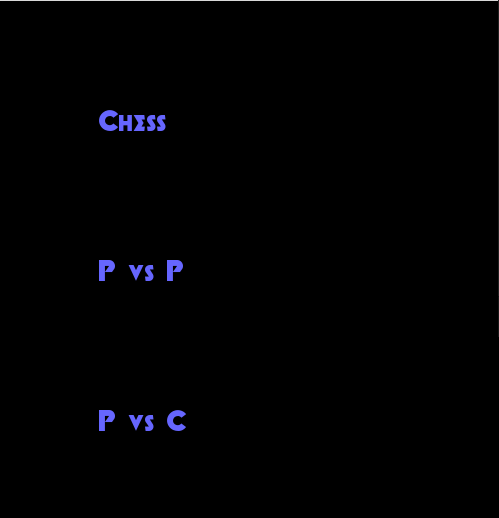

# Chess
 
 > Authors: \<[Yishao Wang](https://github.com/caKuma)\>, \<[Ryan Park](https://github.com/rpark028)\>, \<[akuan004](https://github.com/akuan004)\>, \<[jintei002](https://github.com/jintei002)\>
## Project Description
 > * We would like to make a chess game and to do that we would use c++, github, valgrind and googletest. The input of the game would be mouse and the output would be a gui of the chess board. 
 > 
 > * The language used is C++.
 > * Tools used:
 >   * [Github](https://github.com/) - For code sharing and code repository.
 >   * [Valgrind](https://github.com/) - For for testing functions for memory leaks.
 >   * [Googletest](https://github.com/google/googletest) - For writing unit tests.
 > 
 > * Design patterns:
 > * Composite: We picked this pattern because we’re making a game that can make a lot of use by implementing the players. Our assumption is there would be a lot of overlapping code between each piece such as moving in the directions. That is where the composite design pattern would come into play by using the component to define our default behaviors and the leafs can inherit those components. The chosen design is the most ideal solution for our project because it’s a well known pattern for making use of reusable code. 
 > * Factory: We picked the factory design pattern because this can go hand in hand with the composite design pattern. We would create a “piece” factory and from there you can create different pieces based on their movements. For instance, creating a rook with specific movements.This solves the problem of breaking down the players further and having less functions to rewrite. The chosen pattern will lead to a good solution because it will help us create families of related objects without specifying concrete classes. 
> * This project is interesting because we can put test our knowledge of design patterns to be put to actual use. Also, it's always fun being able to see a product you create yourself.

 > ## Phase II
 > In addition to completing the "Class Diagram" section below, you will need to 
 > * Set up your GitHub project board as a Kanban board for the project. It should have columns that map roughly to 
 >   * Backlog, TODO, In progress, In testing, Done
 >   * You can change these or add more if you'd like, but we should be able to identify at least these.
 > * There is no requirement for automation in the project board but feel free to explore those options.
 > * Create an "Epic" (note) for each feature and each design pattern and assign them to the appropriate team member. Place these in the `Backlog` column
 > * Complete your first *sprint planning* meeting to plan out the next 7 days of work.
 >   * Create smaller development tasks as issues and assign them to team members. Place these in the `Backlog` column.
 >   * These cards should represent roughly 7 days worth of development time for your team, taking you until your first meeting with the TA
 > .png?raw=true)
## Class Diagram
 > Include a class diagram(s) for each design pattern and a description of the diagram(s). Your class diagram(s) should include all the main classes you plan for the project. This should be in sufficient detail that another group could pick up the project this point and successfully complete it. Use proper OMT notation (as discussed in the course slides). You may combine multiple design patterns into one diagram if you'd like, but it needs to be clear which portion of the diagram represents which design pattern (either in the diagram or in the description). 
 
 > ## Phase III
 > You will need to schedule a check-in with the TA (during lab hours or office hours). Your entire team must be present. 
 > * Before the meeting you should perform a sprint plan like you did in Phase II
 > * In the meeting with your TA you will discuss: 
 >   - How effective your last sprint was (each member should talk about what they did)
 >   - Any tasks that did not get completed last sprint, and how you took them into consideration for this sprint
 >   - Any bugs you've identified and created issues for during the sprint. Do you plan on fixing them in the next sprint or are they lower priority?
 >   - What tasks you are planning for this next sprint.

 > ## Final deliverable
 > All group members will give a demo to the TA during lab time. The TA will check the demo and the project GitHub repository and ask a few questions to all the team members. 
 > Before the demo, you should do the following:
 > * Complete the sections below (i.e. Screenshots, Installation/Usage, Testing)
 > * Plan one more sprint (that you will not necessarily complete before the end of the quarter). Your In-progress and In-testing columns should be empty (you are not doing more work currently) but your TODO column should have a full sprint plan in it as you have done before. This should include any known bugs (there should be some) or new features you would like to add. These should appear as issues/cards on your Kanban board. 
 
 ## Screenshots

 ## Installation/Usage
 > Instructions on installing and running your application
 ## Testing
 > How was your project tested/validated? If you used CI, you should have a "build passing" badge in this README.
 
